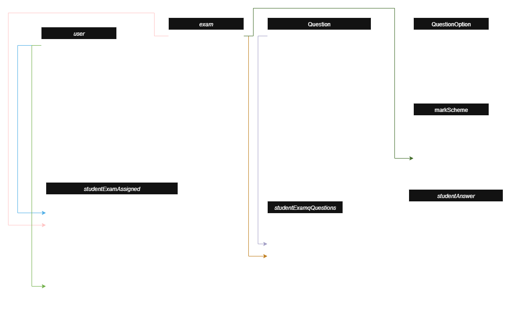
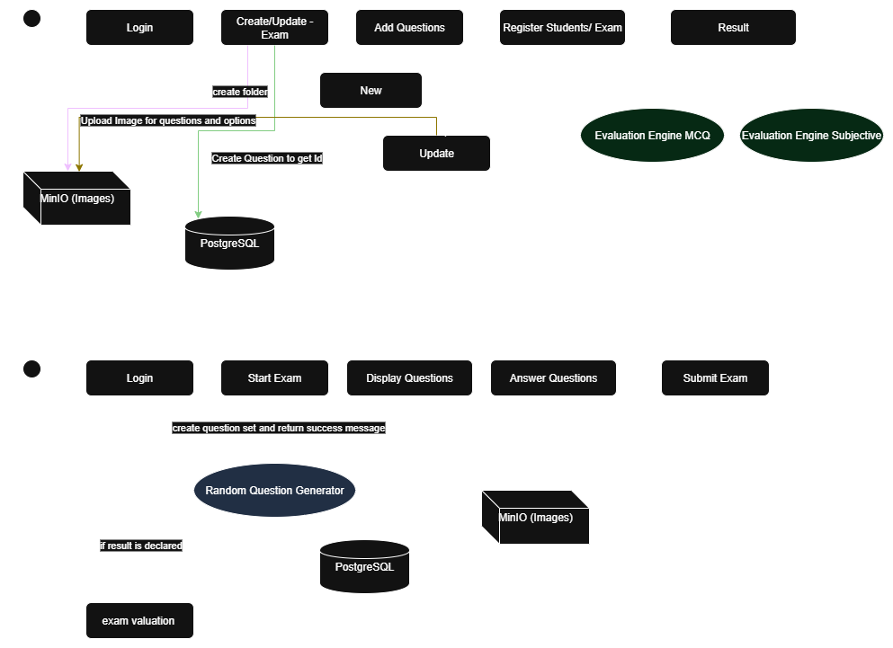

## 🎨 Class Diagram


## 🎨 Flow Diagram



## 🔧 Why These Dependencies?
- **Spring Web** - Provides all the necessary components to build RESTful web services (like controllers, request mappings).
- **Spring Data JPA** - Makes database operations easier using JpaRepository. No need to write boilerplate SQL.
- **PostgreSQL Driver** - Required to connect Java (Spring) with PostgreSQL.
- **Spring Security (later for Keycloak)** - Used for securing endpoints and integrating with Keycloak using OAuth2 or OpenID.
- **Lombok** - Removes boilerplate (getters/setters/constructors).
- **Validation** - Ensures input correctness (@NotNull, @Size, etc.).
- **Spring Boot Actuator (Optional)** - Helps monitor app health, metrics, etc.


## 🔧 Minio Setup:
```bash
docker run -p 9000:9000 -p 9001:9001 --name minio -e "MINIO_ROOT_USER=minioadmin" -e "MINIO_ROOT_PASSWORD=minioadmin" quay.io/minio/minio server /data --console-address ":9001"
```

## 🔧 Keycloak Setup:

```
docker pull quay.io/keycloak/keycloak:latest

docker run --name keycloak -p 8080:8080 -e KEYCLOAK_ADMIN=admin -e KEYCLOAK_ADMIN_PASSWORD=admin quay.io/keycloak/keycloak:latest start-dev
```

### Create realm, roles, users (UI steps)

- Login to Keycloak Admin Console → top-left Realm dropdown → Add realm
  - Name: exam-portal
  - Create roles (Realm Roles)

### Create clients
- Left menu → Clients → Create
  - Client ID: exam-portal-frontend
  - Protocol: openid-connect
  - Access Type: Public,
    If backend exchanges code (recommended): frontend is public but backend will use confidential client to exchange code OR frontend triggers backend to exchange code. In our repo we use the backend to exchange code (so backend needs a confidential client too).
    - Root URL / Valid Redirect URIs:
    ```
    http://localhost:3000/*
    or exact
    http://localhost:3000/login/callback
    ```
    - Web Origins: http://localhost:3000
    - Standard Flow Enabled: ON

### Client configuration details (redirect URI, PKCE, logout)
Valid redirect URIs

Must exactly match what Keycloak receives.

```
Example:

http://localhost:3000/login/callback

Post logout redirect URIs

Add http://localhost:3000 (or exact page).
```

### Create test user (manual)
- Left menu → Users → Add user

## 📖 API Documentation

All backend API endpoints (Users, Exams, Questions, Assignments, Attempts, Results) are documented in:

👉 [api-document.md](api-document.md)

You can also import the Postman collection for ready-to-use requests:
`docs/exam.v2.postman_collection.json`

## 📖 Example Data Set
- [example_data.sql](example_data.sql)
