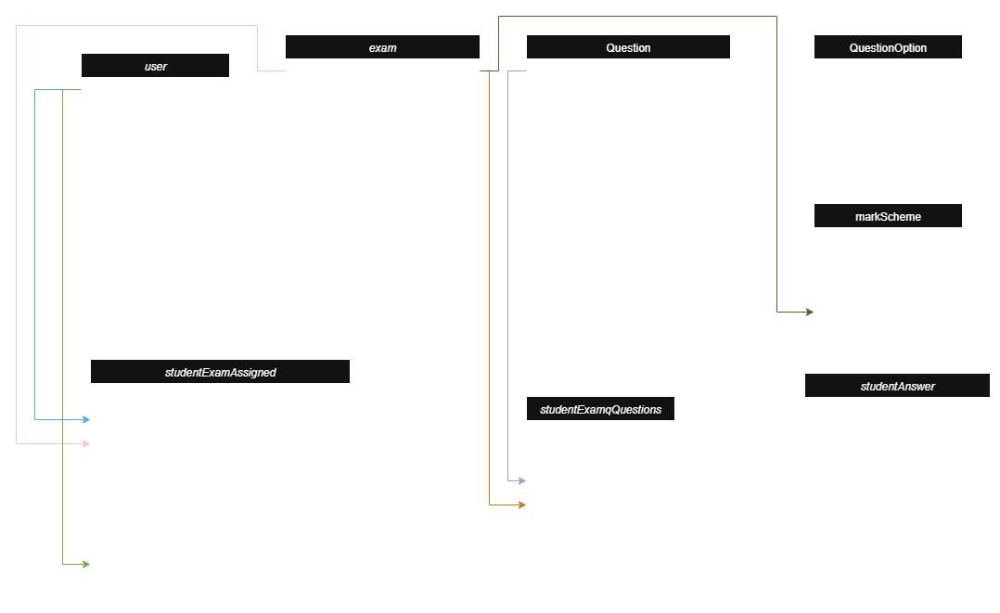

## 🎨 Class Diagram


## 🎨 Flow Diagram


## 🔧 Why These Dependencies?
- **Spring Web** - Provides all the necessary components to build RESTful web services (like controllers, request mappings).
- **Spring Data JPA** - Makes database operations easier using JpaRepository. No need to write boilerplate SQL.
- **PostgreSQL Driver** - Required to connect Java (Spring) with PostgreSQL.
- **Spring Security (later for Keycloak)** - Used for securing endpoints and integrating with Keycloak using OAuth2 or OpenID.
- **Lombok** - Removes boilerplate (getters/setters/constructors).
- **Validation** - Ensures input correctness (@NotNull, @Size, etc.).
- **Spring Boot Actuator (Optional)** - Helps monitor app health, metrics, etc.


## 🔧 Minio Setup:
```bash
docker run -p 9000:9000 -p 9001:9001 --name minio -e "MINIO_ROOT_USER=minioadmin" -e "MINIO_ROOT_PASSWORD=minioadmin" quay.io/minio/minio server /data --console-address ":9001"
```

## keylock Setup:

```
docker pull quay.io/keycloak/keycloak:latest

docker run --name keycloak -p 8080:8080 -e KEYCLOAK_ADMIN=admin -e KEYCLOAK_ADMIN_PASSWORD=admin quay.io/keycloak/keycloak:latest start-dev
```

## 📖 API Documentation

All backend API endpoints (Users, Exams, Questions, Assignments, Attempts, Results) are documented in:

👉 [api-document.md](api-document.md)

You can also import the Postman collection for ready-to-use requests:
`docs/exam.v2.postman_collection.json`

## 📖 Example Data Set
- [example_data.sql](example_data.sql)
